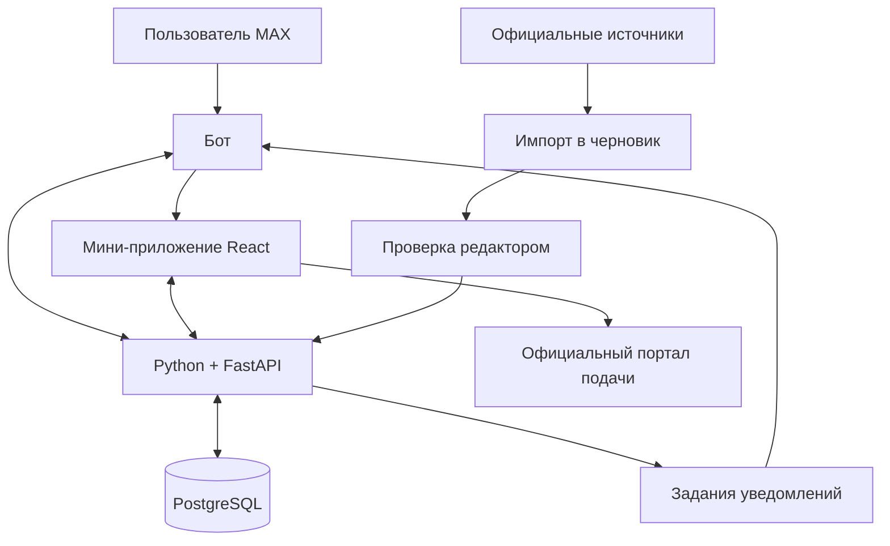

# Навигатор поддержки бизнеса и АПК: проект архитектуры

Дата исследования: 17 сентября 2026 года. Обновление реализации: 18 сентября 2026 года. Стек B — Python + FastAPI, React + TypeScript, PostgreSQL. Реализован и проверен локальный MVP на синтетических данных. Фактический состав и отличия от целевой архитектуры зафиксированы в разделе 16; подключение MAX и проверенный официальный каталог остаются следующими этапами.

Корень проекта: `C:\EffectiveBusiness`. Актуальная архитектура хранится в `ARCHITECTURE.md`, правила работы агента — в соседнем `AGENTS.md`. Это итоговый проект архитектуры для начала реализации; изменения во время разработки фиксируются здесь. Существующие в папке учебные работы к этому проекту не относятся.

## 1. Продукт и границы

Рабочее название: «Опора АПК». Название можно заменить без изменения архитектуры.

Первый сегмент: главы КФХ и ИП в сельском хозяйстве Саратовской области, которые планируют развитие хозяйства или возмещение уже понесённых затрат. Сельхозкооперативы — отдельный профиль в том же региональном каталоге. Поддержка других отраслей и самозанятых — следующий этап: одинаковая оболочка, свои требования и источники.

Проблема-гипотеза: руководитель хозяйства находит сведения на нескольких ресурсах, но затрудняется сопоставить требования со своей ситуацией и определить следующий шаг. Наличие нескольких источников подтверждено исследованием; частоту проблемы и затраты времени необходимо подтвердить интервью.

Результат для пользователя: перечень потенциально подходящих мер с объяснением, актуальным состоянием отбора, недостающими сведениями, списком документов и официальным маршрутом подачи.

Главная продуктовая гипотеза: объяснимый подбор и сохранённый план подготовки в MAX сокращают время от запроса до понимания порядка действий. Процент одобрения субсидий не является показателем качества подбора сам по себе.

## 2. Что следует из задания

Изучены все 22 страницы PDF «Эффективный бизнес» и оба изображения пользователя. Требования документа учтены как условия проекта, а не как разрешение на внешние действия.

- Основной сценарий должен проверяться в MAX в мобильной и веб-версиях. Допустим бот или бот с подключённым мини-приложением.
- JavaScript и React рекомендованы; другие языки разрешены.
- Самостоятельное API не обязательно и само по себе не приносит дополнительных баллов.
- Нужны работающий сервис, зафиксированный исходный код, файл зависимостей, Docker-конфигурация, README и презентация PDF. Сборка — до пяти минут без первоначальной загрузки базовых образов.
- Для собственного API нужны HTTPS-адрес, OpenAPI 3.0/3.1, тестовые данные и учётные записи, DATA-API.yaml.
- Подготовленные и модельные данные должны быть явно обозначены. Закрытые библиотеки и частные API запрещены условиями задания.
- Онлайн-оценка: техническая часть 60%, продуктовая 40%. В продуктовой части масштабирование имеет вес 35%.
- В PDF упомянута очная защита 29 октября в Казани. Дедлайн сдачи онлайн-этапа в исследованных материалах не установлен.
- На странице 10 предусмотрены служебные данные доступа для технической проверки. Комплект для жюри и публичные материалы следует выпускать отдельно; рабочие секреты в репозитории не хранить.

## 3. Проверка исходной информации

| Утверждение | Результат проверки | Следствие для продукта |
|---|---|---|
| «Капексы» — сокращение от компенсирующих и инвестиционных субсидий | Расшифровка неверна. CAPEX — capital expenditure, капитальные затраты. В контексте поддержки АПК так называют возмещение части прямых затрат на создание и модернизацию объектов | Искать по разговорному слову можно, но карточка должна содержать точное название меры. Не относить к капексам все субсидии |
| navigator.813.ru — общий навигатор | Сервис связан с фондом поддержки предпринимательства Ленинградской области, что подтверждается сайтом 813.ru | Использовать как аналог продукта. Региональные условия нельзя переносить в Саратовскую область |
| МСП.РФ и «Мой бизнес» — одно название | МСП.РФ — цифровая платформа Корпорации МСП; «Мой бизнес» — сеть и бренд инфраструктуры поддержки | Сохранять отдельные организации, источники и каналы обращения |
| Все меры поддержки оформляются в «Электронном бюджете» | Для найденного саратовского отбора «Агромотиватор» 2026 года такой маршрут указан прямо. Для всего набора мер бизнеса — консультаций, кредитов, гарантий и других услуг — единый маршрут не подтверждён | Канал подачи хранить у конкретного отбора/услуги; показывать банк, фонд, МСП.РФ или иной канал только по источнику |
| На АПК региона в 2026 году предусмотрено 3 287,9 млн рублей | Такая плановая сумма есть в индексируемой январской публикации ФГБУ «Центр Агроаналитики» со ссылкой на региональный Минсельхоз. Полное открытие страницы при проверке было недоступно | Это сведения о плановом бюджете, а не о доступном остатке средств и не о сумме на одного заявителя |
| На развитие малого агробизнеса предусмотрено 248,3 млн рублей | Подтверждено доступной публикацией Минфина Саратовской области о планах на 2026 год | Может служить обоснованием масштаба темы с указанием периода и источника |
| На фотографии указаны действующие сроки 18, 20 и 26 сентября | В доступных первичных источниках эти конкретные сроки не подтверждены. Найден другой отбор «Агромотиватор»: 16.07–09.08.2026, шифр 26-009-R0166-1-0115 | Не объявлять сентябрьские отборы открытыми. Июльско-августовский отбор хранить как завершившийся; наличие более позднего отбора требует отдельной проверки |

Фотография содержит распечатку ответа ИИ и отметку «1/2». Вторая страница распечатки не предоставлена. Снимок полезен как список направлений для исследования, но не заменяет объявления и нормативные документы. Сумму уже перечисленных 2,4 млрд рублей, остальные частные суммы и указанные на фотографии размеры грантов как актуальные не подтверждаем.

Главная страница регионального Минсельхоза доступна и содержит раздел «Субсидии на развитие сельского хозяйства». Сам раздел, федеральный раздел Минсельхоза и портал promote.budget.gov.ru не удалось полноценно прочитать инструментом при исследовании. Поэтому этот документ не является полным реестром открытых на 17.09.2026 отборов.

## 4. Пользовательский сценарий

1. Пользователь открывает бота MAX и выбирает «Подобрать поддержку».
2. В мини-приложении проходит короткую анкету: регион деятельности и регистрации, форма хозяйства, направление, срок работы, цель, стадия расходов и наличие собственных средств. Дополнительные вопросы появляются только для оставшихся кандидатов.
3. При необходимости уточняет специальные условия: полученная ранее поддержка, статус МСП, показатели хозяйства, права на землю/объекты. Ответ «не знаю» допустим и не превращается в отказ.
4. Получает результаты с причинами: «Предварительно подходит», «Нужно уточнить», «Есть несоответствие». Статус приёма заявок показывается отдельно.
5. Открывает карточку: что финансируется, размер/формула и ограничения, требования, сроки с часовым поясом, документы, обязательства после получения, источник, дата проверки, контакт консультанта.
6. Нажимает «План подготовки» и отмечает готовность документов. Оригиналы паспортов, банковских документов и электронных подписей в MVP не загружаются.
7. Переходит к официальному отбору. Если стабильной ссылки на отбор нет, получает адрес портала и копируемый шифр поиска.
8. При желании подписывается на напоминания в MAX. Уведомления можно отключить.

Переход по ссылке не означает подачу заявки. В MVP состояние «Подал заявку» может быть только отметкой самого пользователя и так и подписывается. Официальные статусы не имитируются.

Если подходящих открытых отборов нет, сервис объясняет результат и предлагает подтверждённый контакт консультации, изменение параметров либо подписку на новые объявления. Не обещает получение денег.

## 5. Состав MVP

| Обязательная функция | Критерий готовности |
|---|---|
| Вход через MAX и восстановление анкеты | Один профиль открывается повторно в мобильной и веб-версиях |
| Каталог 10–15 тщательно проверенных мер | Каждая карточка имеет источник, регион, применимый период, дату проверки и явный статус данных |
| Подбор по правилам | Каждый результат содержит причины и перечень неизвестных условий |
| Карточка меры и отбора | Пользователь различает общую программу и конкретный приём заявок |
| План подготовки | Документы и шаги сохраняются после повторного входа |
| Официальный маршрут | Ссылка ведёт к нужному ресурсу; при необходимости показан шифр отбора |
| Минимальная панель редактора | Черновик, проверка, публикация, новая версия, снятие с публикации |
| Воспроизводимая проверка | Docker, тестовые профили, сценарии проверки и описание ограничений |

Количество мер — целевой объём, а не готовый проверенный каталог. Начальная тематическая выборка: развитие фермерского хозяйства, кооперация, отдельные направления растениеводства/животноводства, консультационная поддержка. Капексы включаются при наличии подтверждённых применимых условий. «Агромотиватор» не рекомендуется всем фермерам: у него специальная категория заявителей.

После основного сценария: сравнение 2–3 мер, напоминания, уведомления об изменённых требованиях, поиск по бытовым словам. После пилота: дополнительный регион и другие категории бизнеса.

## 6. Выбранный стек B

Выбор пользователя: Python + FastAPI для серверной части, React + TypeScript для мини-приложения, PostgreSQL для базы данных. Основной язык бизнес-логики — Python.

| Часть проекта | Технология и назначение |
|---|---|
| Сервер | Python + FastAPI: API, анкеты, каталог, подбор и планы подготовки |
| Бот MAX | Python: адаптер официального HTTP API MAX и обработчики событий в серверном приложении |
| Мини-приложение | React + TypeScript: пользовательский интерфейс внутри MAX |
| Панель редактора | Отдельные защищённые страницы того же React-приложения |
| База данных | PostgreSQL: данные, версии условий, задания и журнал изменений |
| Контракт обмена | OpenAPI: единое описание запросов и ответов; генерация TypeScript-клиента из серверного контракта |
| Запуск | Docker Compose: воспроизводимое окружение для разработки и проверки |

Правила подбора реализуются на Python и выполняются на сервере. Интерфейс отображает полученные результаты и причины, не дублируя алгоритм проверки условий. Сгенерированный клиент помогает согласовать два языка; входные данные дополнительно проверяются сервером.

Python-адаптер MAX использует документированный HTTP API. Выбор сторонней библиотеки, если она понадобится, требует проверки совместимости и лицензии. Node.js используется для сборки интерфейса; отдельный сервер на Node.js в выбранной архитектуре не нужен.

Планируемая структура репозитория (это схема, файлы реализации ещё не созданы):

```text
C:/EffectiveBusiness/
  ARCHITECTURE.md     # Актуальная архитектура
  AGENTS.md           # Правила работы агента
  backend/
    app/
      api/           # HTTP-маршруты и проверка запросов
      max_adapter/   # Бот и проверка данных запуска MAX
      profiles/      # Анкеты
      catalog/       # Меры, версии и отборы
      matching/      # Правила и объяснения
      preparation/   # Планы подготовки
      editorial/     # Проверка и публикация карточек
      jobs/          # Фоновые задания
      db/            # Доступ к PostgreSQL
    migrations/
    tests/
  frontend/
    src/
      features/      # Экраны и пользовательские сценарии
      api/           # Клиент серверного API
      max/           # Взаимодействие с MAX Bridge
  data/              # Проверенные карточки и отдельно тестовые данные
  docs/              # API, источники и сценарий проверки
  compose.yaml
  .env.example
  README.md
```

Использовать поддерживаемые стабильные версии и фиксировать их при старте разработки. Официальная документация MAX на дату исследования указывает домен platform-api2.max.ru и передачу токена в Authorization. Настройку адреса вынести в конфигурацию, перед запуском сверить документацию ещё раз.

## 7. Архитектура

Модульный монолит: одно серверное приложение с разделением ответственности. Раздельные микросервисы, отдельная поисковая система и векторная база для первой версии не нужны.



| Модуль | Ответственность |
|---|---|
| MAX adapter | События бота, ответы, открытие мини-приложения, проверка данных запуска |
| Profiles | Анкета, согласия, сохранённые ответы и цели |
| Catalog | Версии мер, отборы, документы, источники и контакты |
| Matching | Проверка правил, объяснения, уточняющие вопросы и порядок выдачи |
| Preparation | Избранное, шаги и отметки готовности документов |
| Editorial | Импорт, редакторская проверка, публикация и журнал изменений |
| Jobs | Напоминания, контроль доступности источников, очередь изменений |

Мини-приложение и API размещаются на одном HTTPS-домене. В базовом Docker Compose достаточно Python-приложения и PostgreSQL: собранный React-интерфейс включается в образ приложения и обслуживается как статические файлы. Node.js нужен на стадии сборки интерфейса. Для самостоятельного публичного размещения добавляется HTTPS-прокси. Фоновый обработчик может запускаться из того же Python-образа; очередь заданий на первом этапе хранится в PostgreSQL.

Для локальной разработки бот может получать события через long polling; в размещённой версии — webhook. Одновременно оба способа для одного окружения не использовать. Публичный MAX-бот и мини-приложение должны оставаться доступными в период проверки, даже если локальная копия остановлена.

## 8. Модель данных

| Сущность | Основные данные |
|---|---|
| User | Внутренний ID, подтверждённый MAX ID, настройки и согласия |
| BusinessProfile | Организационная форма, признаки КФХ, регионы регистрации/деятельности, отрасль, срок работы, цели |
| SupportMeasure | Постоянный ID и название меры, вид поддержки, оператор |
| MeasureVersion | Период действия, условия, ограничения, правила, документы, источник и статус проверки |
| SelectionRound | Шифр, ссылка, даты и часовой пояс, состояние отбора, бюджет, версия условий |
| SourceDocument | URL, орган-издатель, название/номер документа, дата публикации, снимок и контрольная сумма |
| Evidence | Связь конкретного поля/правила с пунктом источника |
| MatchEvaluation | Снимок ответов, версия правил, результат каждой проверки, время оценки |
| PreparationPlan | Пользователь, отбор, версия списка документов, отметки готовности |
| Subscription / NotificationJob | Подписка, событие, время доставки, попытки и защита от дублей |
| AuditEvent | Автор и дата изменения, предыдущая и новая версии |

КФХ, юридическая форма и налоговый режим — отдельные признаки: например, статус самозанятого не следует смешивать с организационной формой. Региональная применимость определяется условиями меры, а не только текущим местоположением человека.

Денежные поля разделяются: общий бюджет программы, бюджет отбора, предел на заявителя, доля софинансирования, ставка компенсации. Формулы хранятся в версии условий; при отсутствии подтверждённой формулы расчёт не выполняется. Лимиты разных мер не складываются автоматически: расходы могут пересекаться, а меры иметь ограничения совместимости.

Отбор связан с конкретной версией условий. Изменение требований не переписывает историю результатов; сохранённым пользователям показывается, что необходимо проверить заново.

## 9. Логика подбора

Правила декларативные, с операторами AND/OR, сравнением чисел, дат и принадлежности списку. Произвольный исполняемый код из карточек запрещён.

Каждое условие возвращает PASS, FAIL или UNKNOWN. Поиск слов и синонимов помогает найти кандидатов, но не определяет право на поддержку.

- Есть подтверждённое обязательное несоответствие — показать причину.
- Нет несоответствия, но есть неизвестные условия — запросить уточнение.
- Известные условия выполнены — показать предварительное соответствие анкете, с оговоркой о проверке документов и конкурсном решении.
- Отдельная ось: приём открыт, запланирован, завершён, приостановлен, отменён или состояние не подтверждено.
- Прошедший срок закрывает выдачу «можно подать сейчас»; открытый по датам, но давно не проверенный отбор получает отметку о необходимости проверки.

Ранжирование: применимость к профилю и цели, подтверждённая доступность подачи, срочность, объём оставшейся подготовки. Не показывать выдуманный процент вероятности одобрения.

LLM не является зависимостью MVP. Позже её можно подключить для объяснения опубликованных условий с цитатами. Извлечение новых правил — только в редакторский черновик. Ошибка или недоступность модели не должна ломать подбор.

## 10. Актуализация данных

Начало: ручная подготовка каталога в JSON/CSV с проверкой схемы и редакторская публикация. Это честно обозначенная подготовленная база, а не интеграция с государственными системами.

Следующий этап: разрешённая загрузка открытых страниц и документов по реестру источников, сохранение снимков, обнаружение изменений и создание черновиков. Публичность сайта не означает наличие доступного API. CAPTCHA, авторизацию и ограничения сайтов не обходить.

Предлагаемый регламент: ежедневная проверка активных отборов в период приёма и еженедельная проверка остальных карточек. Это проектный регламент, не выполненное обязательство текущего исследования. Редактор подтверждает содержательную актуальность; успешная загрузка страницы сама по себе не считается такой проверкой.

При конфликте объявления и нормативного документа запись направляется на проверку, автоматическая рекомендация «подать сейчас» блокируется. При недоступности источника сохраняется последняя проверенная версия с датой; свежесть не обновляется автоматически.

## 11. API и доступ

Примерный контракт для выбранного варианта с мини-приложением:

| Метод | Назначение |
|---|---|
| POST /api/auth/max | Проверить подписанные данные запуска, выдать короткую сессию |
| GET /api/catalog | Каталог опубликованных карточек с фильтрами |
| PUT /api/profile | Сохранить анкету текущего пользователя |
| POST /api/matches | Получить результаты и объяснения по версии каталога |
| GET /api/measures/{id} | Условия, источники и связанные отборы |
| POST /api/preparation-plans | Создать личный план подготовки |
| PATCH /api/preparation-plans/{id}/items/{itemId} | Обновить отметку готовности |
| POST /api/subscriptions | Подписаться на выбранное событие |
| DELETE /api/subscriptions/{id} | Отключить подписку |
| POST /api/admin/versions/{id}/publish | Опубликовать проверенную версию |
| GET /health | Проверка состояния сервиса |

Проверять подпись и возраст стартовых данных MAX на сервере по актуальной документации. Не доверять MAX ID, присланному браузером без проверки. Для редактора нужна отдельная роль, назначаемая на сервере. Каждый доступ к анкете и плану ограничен владельцем.

Внешние события обрабатываются повторяемо без создания дублей; для уведомлений предусмотрены очередь, ограниченные повторы и журнал ошибок. Не гарантировать абсолютное отсутствие повторной доставки при неопределённом ответе внешнего API.

Токены находятся только на сервере; персональные сведения и секреты не выводятся в журнал. Для тестов использовать синтетические профили. На пилоте согласовать минимальный состав собираемых данных, сроки хранения и размещение сервиса. Основной сценарий не требует хранения документов, паролей Госуслуг или ключей электронной подписи.

## 12. Проверка качества и пилот

Обязательные сценарии проверки:

1. Подходящий профиль получает объяснимый результат и правильный официальный маршрут.
2. Другой регион или неподходящая форма хозяйства дают понятную причину несоответствия.
3. Ответ «не знаю» даёт UNKNOWN, а не ложное соответствие или отказ.
4. Просроченный отбор не показывается открытым; граница времени учитывает часовой пояс объявления.
5. Специальная категория заявителей не теряется при подборе «Агромотиватора».
6. Изменение правил создаёт новую версию и требует повторной проверки сохранённого плана.
7. Недоступность источника не обновляет дату подтверждения условий.
8. Повторный webhook не создаёт второй план; пользователь не может открыть чужую анкету.
9. Некорректные данные запуска MAX не дают сессию.
10. Сценарий проходит в мобильной и веб-версиях MAX, а окружение разворачивается одной командой.

Пилот-гипотеза: 10–15 представителей целевого сегмента и один консультант по господдержке. Сначала 5–7 интервью о реальном последнем поиске поддержки, затем сравнение самостоятельного поиска и сценария продукта. Для повторного задания использовать сопоставимые разные кейсы, чтобы снизить эффект запоминания.

Измерять время до корректного плана действий, долю завершённых сценариев, ошибки отбора относительно экспертной оценки и понятность причин. Предлагаемые цели пилота: медиана прохождения до пяти минут, завершение не менее 80%, отсутствие рекомендаций с известными жёсткими несоответствиями на согласованном тестовом наборе. Это цели, а не полученные результаты.

## 13. Этапы и масштабирование

1. Стек B выбран. Уточнить состав команды, дедлайн, доступ к токену MAX и место размещения перед соответствующими этапами реализации.
2. Провести интервью и подготовить проверенный небольшой каталог с историческими и текущими данными, явно разделёнными по состоянию.
3. Собрать минимальный сквозной сценарий: бот → анкета → подбор → карточка → план → официальный переход.
4. Добавить редакторскую публикацию, обработку ошибок и проверки доступа.
5. Проверить на пользователях, подготовить воспроизводимую сборку и материалы жюри.
6. При достаточном времени добавить сравнение и напоминания.

Срок разработки нельзя надёжно определить без дедлайна и навыков команды. При жёстком дефиците времени использовать тот же сервер и правила в формате бота, а мини-приложение добавить позже: формат бота разрешён заданием.

Масштабирование: сначала соседний регион с партнёром-редактором, затем отдельный пакет мер для другого сегмента МСП. Повторно используются анкета как движок, каталог, версия условий, подбор и интерфейс. Добавляются региональные справочники, вопросы, нормативные документы, правила, контакты и каналы подачи. Нужны ответственный эксперт и регламент обновлений; сам факт добавления региона в фильтр не означает готовности продукта в этом регионе.

## 14. Источники и ограничения исследования

- Предоставленный PDF «Эффективный бизнес», страницы 1–22: требования, критерии и рекомендации проекта.
- [Минсельхоз Саратовской области](https://minagro.saratov.gov.ru/): проверена главная страница и наличие раздела субсидий; сам раздел не удалось прочитать.
- [Федеральный раздел поддержки АПК](https://mcx.gov.ru/activity/state-support/measures/): адрес найден, содержимое при проверке недоступно.
- [Минфин Саратовской области: планы поддержки малого агробизнеса в 2026 году](https://minfin.saratov.gov.ru/press-tsentr/novosti/3132-20251226-zamestitel-ministra-finansov-oblasti-provel-priem-grazhdan-v-algajskom-rajone): прочитано, подтверждает плановые 248,3 млн рублей.
- [Администрация Энгельсского района: отбор «Агромотиватор» 2026 года](https://xn--c1aesfx9dc.xn--p1ai/informatsiya-dlya-selkhoztovaroproizvoditelej/108632-ob-obyavlenii-otbora-agromotivator): прочитано; период 16.07–09.08.2026, шифр, категория заявителей и канал подачи. Не доказывает отсутствие последующих отборов.
- [Центр Агроаналитики: план поддержки АПК региона на 2026 год](https://specagro.ru/news/202601/na-gospodderzhku-saratovskogo-apk-v-2026-godu-vydelyat-okolo-33-mlrd-rub): доступен индексируемый фрагмент, полная страница не открылась.
- [Корпорация МСП: цифровая платформа МСП.РФ](https://corpmsp.ru/to-business/msp-rf/): прочитано, описывает самостоятельную платформу и её сервисы.
- [Фонд поддержки предпринимательства Ленинградской области](https://813.ru/) и [его навигатор](https://navigator.813.ru/): прочитаны открытые страницы; персональный подбор за формой не исследовался.
- [Центр Агроаналитики: отраслевое употребление термина «капексы»](https://specagro.ru/news/202009/s-2022-goda-minselkhoz-budet-zamenyat-kapeksy-lgotnym-kreditovaniem-agrariev): исторический источник для термина, не для действующих условий 2026 года.
- [Интервью в отраслевом издании «Животноводство России»](https://zzr.ru/zzr-2023-03-013): объяснение CAPEX и контекст компенсации капитальных затрат; историческая публикация.
- [MAX: API](https://dev.max.ru/docs-api), [мини-приложения](https://dev.max.ru/docs/webapps/introduction), [валидация данных](https://dev.max.ru/docs/webapps/validation): официальные технические источники, просмотрены при подготовке архитектуры.

Этот документ фиксирует архитектурные предложения и результаты ограниченного исследования. Он не подтверждает право конкретного хозяйства на субсидию, наличие остатка бюджета или полный набор действующих отборов. Подготовка проверенного каталога с актуальными редакциями нормативных актов — отдельный этап реализации.

## 15. Навыки агента по этапам разработки

Skills — инструкции для агента по выполнению определённых задач. Они не являются зависимостями приложения, не включаются в Docker-образ и не требуют от пользователей навигатора подписки или установки Codex. Доступность ниже отражает текущую сессию; перед будущим использованием необходимо проверить актуальный каталог навыков и прочитать соответствующий `SKILL.md`.

### Основная разработка

Для Python, FastAPI, React, TypeScript, PostgreSQL, миграций, Docker и автоматических тестов отдельного профильного skill в текущем каталоге нет. Эти части реализуются обычными средствами разработки по `AGENTS.md`, официальной документации технологий и архитектуре проекта. Отсутствие такого skill не блокирует разработку и не требует установки стороннего плагина.

| Этап / задача | Навык или инструмент | Когда использовать | Ожидаемый результат |
|---|---|---|---|
| Разбор задания, нормативных актов и объявлений в PDF | `pdf:pdf` | При чтении PDF и проверке таблиц, примечаний и приложений | Извлечённые условия с проверкой страниц и точными ссылками на основание |
| Поиск действующих условий поддержки и документации API | Веб-поиск и чтение официальных источников; отдельный skill не нужен | При наполнении каталога и перед реальным подключением MAX | Проверенные источники с датами; подтверждённые требования API |
| Реализация API, правил подбора, базы и миграций | Обычные инструменты работы с кодом и терминалом | При разработке `backend/` | Работающий сервер, миграции и содержательные тесты |
| Реализация мини-приложения и панели редактора | Обычные инструменты работы с кодом и терминалом | При разработке `frontend/` | Интерфейс React + TypeScript, согласованный с контрактом API |
| Проверка интерфейса в доступном браузере и веб-версии MAX | `computer-use:computer-use` и доступные средства браузерного управления | Когда нужен реальный проход по экранным формам, кнопкам и переходам | Проверенный пользовательский путь, обнаруженные и исправленные ошибки интерфейса |
| Проверка мобильной версии MAX | Доступное реальное устройство / среда тестирования | Перед сдачей и после существенных изменений интерфейса | Подтверждение работы в мобильном MAX; браузерную эмуляцию не выдавать за эту проверку |
| Сборка, тесты, Docker и подготовка запуска | Обычные инструменты терминала; отдельный skill не нужен | При проверке реализации и подготовке сдачи | Воспроизводимый запуск и фактический отчёт о проверках |
| Создание презентации для защиты | `presentations:Presentations` | При подготовке или редактировании слайдов | Презентация с проблемой, сценарием, архитектурой, результатами и источниками |
| Финальная проверка презентации в PDF | `pdf:pdf` | При проверке экспортированного PDF для сдачи | Читаемые страницы без обрезанного текста, проверенные ссылки и данные |

### Дополнительные задачи

| Задача | Навык | Условие использования |
|---|---|---|
| Обработка реестра мер в XLSX/CSV или результатов интервью в таблице | `spreadsheets:Spreadsheets` | Если входной или выходной материал — таблица; основной рабочий каталог приложения по-прежнему хранится в PostgreSQL |
| Подготовка пояснительной записки, инструкции или отчёта в DOCX | `documents:documents` | Если нужен именно Word-документ. Для `README.md`, `AGENTS.md` и `ARCHITECTURE.md` skill не требуется |
| Создание растровой иллюстрации для презентации или интерфейса | `imagegen` | Только если такая иллюстрация помогает задаче. Обычные формы и схемы делать средствами интерфейса и Mermaid |
| Интерактивное объяснение механики подбора команде | `visualize:visualize` | По необходимости для обсуждения; такой прототип не заменяет реализацию мини-приложения |
| Настройка Codex, выбор модели или работа с OpenAI API | `openai-docs` | Для вопросов об OpenAI. Не использовать как документацию FastAPI или MAX; OpenAI API не входит в обязательный стек MVP |
| Создание переиспользуемого навыка проверки мер поддержки | `skill-creator` | Если пользователь отдельно поручит оформить уже проверенный процесс в skill; для первого MVP это не обязательный этап |

### Границы применения

- `sites:sites-building` и `sites:sites-hosting` не входят в текущий план: это разработка собственного проекта FastAPI + React. Использовать Sites только при явном решении пользователя применять эту платформу.
- `spreadsheets:excel-live-control` требуется только для отдельной задачи управления открытой сессией Excel; работа с обычным CSV не является таким случаем.
- Не устанавливать дополнительные плагины только из-за совпадения названия с этапом проекта. Сначала проверить имеющиеся средства и реальную потребность.
- Наличие skill не означает наличие доступа к внешнему сервису, токена MAX или мобильному устройству. Ограничения доступа отражаются в отчёте о проверках.
- Для каждого выбранного навыка перед первым применением прочитать его `SKILL.md` и кратко сообщить пользователю о применении. Использовать только относящиеся к текущей задаче навыки.
- Имена и расположение skill могут меняться с обновлениями среды. Искать их в доступном каталоге текущей сессии; не связывать запуск продукта с путями к локальному кешу Codex.

## 16. Фактическая реализация локального MVP — 18.09.2026

Этот раздел уточняет целевое описание выше. Наличие цели в предыдущих разделах не означает, что соответствующая интеграция уже подключена.

### Компоненты и хранение

- Один сервер FastAPI обслуживает HTTP API и собранный React. Node.js используется только в многостадийной сборке. Docker Compose поднимает приложение и PostgreSQL 17.6; порты ограничены localhost.
- Модули backend/app: api (HTTP), auth (сессии и роли), catalog (версии и планы), matching (условия и доступность), schemas (контракт), models/db (данные), max_adapter/jobs (MAX и очередь).
- Отдельные таблицы: measures, measure_versions, selection_rounds, users, auth_sessions, used_launches, profiles, evaluations, preparation_plans, audit_events, bot_events.
- Правила, ссылки на источники и документы вложены в JSON конкретной версии с серверной валидацией. Отдельного реестра нормативных документов и пофайлового хранилища сейчас нет. Архивные условия сохраняются вместе с планом через ссылку на неизменяемую версию.
- Номер версии и техническая ревизия редактирования различаются. Частичный уникальный индекс PostgreSQL допускает только одну опубликованную версию меры; публикации блокируют родительскую меру. Устаревшая ревизия возвращает 409.
- Evaluation сохраняет ответы, момент оценки и полные результаты с version_id. План хранит версию, отбор и копию списка документов. Изменение публикации вызывает needs_review. Повторный подбор выполняется по сохранённой анкете вручную; автоматической повторной оценки и уведомлений пока нет.
- Денежные сравнения выполняются Decimal; собственные средства передаются точной десятичной строкой. Учебные benefit являются отображаемым текстом, а не моделью бюджетных лимитов. Отдельные числовые бюджеты меры/отбора/остатка ещё не реализованы и не смешиваются в расчётах.

### Подбор и интерфейс

- Серверный движок поддерживает eq, in, gte, lte, all, any. Отсутствующий ответ даёт UNKNOWN; подтверждённое обязательное несоответствие — FAIL. React получает готовые объяснения.
- Доступность отбора учитывает состояние, начало/окончание, период условий, конфликт источников и свежесть проверки (по умолчанию 7 дней). Сравнение временных отметок выполняется с часовым поясом; UI показывает часовой пояс конкретного объявления.
- Интерфейс на русском: обзор, трёхшаговая анкета, каталог/подбор, карточка, планы и редактор. Типы API сгенерированы из docs/openapi.json. На телефоне основная навигация находится снизу.
- Минимальный редактор работает со структурированным JSON, проверяемым сервером: создание, копирование версии, изменение черновика, review, published, archived. Производственный каталог можно начать с пустой БД через форму создания. Полноценный визуальный конструктор правил — дальнейшее улучшение.

### Демонстрация и MAX

- data/demo/catalog.json содержит 6 синтетических мер, а не целевые 10–15 официально проверенных. Все маркированы в интерфейсе. Seed не обновляет даты при каждом перезапуске.
- Изолированные demo-аккаунты farmer/editor/second не являются настоящей аутентификацией. В production демовход отсутствует, seed запрещён, запуск на базе с demo users / synthetic measures блокируется.
- MAX Bridge подключается только при настроенном MAX. Сервер проверяет launch HMAC, возраст (политика проекта 10 минут), повторы и роли; cookie HttpOnly/Secure в production, CSRF и Origin для изменений.
- Реализованы webhook secret, дедупликация и PostgreSQL-очередь для ответов на действия пользователя. Очередь опциональна через compose.max.yaml. Реальный токен, webhook и HTTPS-размещение не настроены. Возможность повторной внешней доставки при неопределённом сетевом исходе документирована; exactly-once не заявляется.
- Публичная эксплуатационная защита, ограничение частоты и размера запросов на proxy, резервное копирование и политика хранения данных должны быть настроены перед реальным размещением. Локальная версия не объявляется готовой к обработке реальных персональных данных.

### Проверки и комплект

22 автоматических теста на настоящем PostgreSQL, 14 шагов DATA-API.yaml против работающего контейнера, сборка TypeScript/React, миграции и alembic check, браузерный путь фермера и редактора. Проверены ширины 390 и 1440 px; это не проверка в мобильном MAX. Сборка без кеша при готовых базовых образах заняла 50,13 секунды на текущем компьютере.

Инструкции: README.md; фактический журнал: docs/PROGRESS.md; MAX: docs/MAX.md. API: OpenAPI 3.1 в docs/openapi.json, сценарии DATA-API.yaml. Презентации: output/submission/public/ и output/submission/jury/; ранний PDF-обзор удалён при очистке 20.09.2026. Идентификация текущих исходников: docs/SOURCE-SHA256.txt; секреты и зависимости окружения в манифест не входят. Зафиксированный комплект 18.09.2026 хранит собственные контрольные суммы и автоматически не обновляется.
## 17. Реальный каталог и подготовка размещения — 18.09.2026

Дополнение к фактической реализации раздела 16, без изменения выбранного стека:

- `data/official/` — отдельный подготовленный набор реальных источников, `data/demo/` — синтетические сценарии. Сохранены официальные PDF/ZIP, HTML-снимок, текстовые извлечения и SHA-256; тяжёлые исходники не входят в Docker-образ. Реальный набор содержит 10 черновиков и 10 отборов, **не 10 опубликованных проверенных рекомендаций**. Полный журнал — docs/CATALOG-REVIEW.md.
- Импорт `backend/import_official.py` валидирует данные, создаёт только отсутствующие реальные меры в состоянии draft и блокирует конкурентный импорт PostgreSQL advisory lock. Существующие записи никогда не обновляются импортом. Изменения условий проходят новую редакторскую версию. Автоматической периодической актуализации нет.
- JSON версии дополнен `legal_edition`, `research_checked_at`, `missing_evidence`, `verification_notes`. Дата исследования отделена от полной проверки. В незавершённом черновике разрешены пустые правила/документы/отборы и неизвестные даты применимости; вымышленные даты больше не требуются. При публикации обязательны документы, правила, период, источники и отсутствие пробелов; реальной мере обязательна редакция актов. Существующие записи совместимы, изменения реляционной схемы не требуются.
- Новый оператор `manual` всегда даёт UNKNOWN; он не читает произвольный код и не превращает неподтверждённое юридическое условие в PASS. Пустой набор правил — UNKNOWN. Закрытие по точному времени приоритетнее устаревания источника, неполная проверка не разрешает статус open. Учебный `special_category` не используется для настоящего «Агромотиватора».
- Редактор разделяет реальные и учебные наборы, показывает пробелы и источники. Каталог поддерживает фильтр происхождения. Черновики не доступны в публичном подборе.
- `compose.production.yaml` — самостоятельное окружение с отдельной БД/томом, production guard и Nginx TLS. Публичны только 80/443 proxy; приложение/БД не имеют опубликованных портов. Proxy ограничивает частоту и размер запросов, журнал доступа исключает query string; access log Uvicorn отключён. Cookie production — HttpOnly/Secure/SameSite=None для web MAX, при сохранённых CSRF и Origin. Реальное поведение cookies в MAX ещё требуется проверить.
- `backend/max_preflight.py` — безопасная read-only диагностика GET /me и GET /subscriptions при наличии токена. Не регистрирует webhook, не отправляет сообщения и не доказывает проверку реального запуска. Токен и HTTPS-домен отсутствуют; MAX не подключён.
- Конфигурация TLS проверена в отдельном локальном production-проекте с тестовым сертификатом и явным локальным доверием в проверяющем клиенте. Это не публичное размещение. Выбор сервера, доверенный сертификат, его автоматическое обновление, внешние резервные копии, восстановление и фактический MAX-тест остаются этапами запуска.

## 18. Подготовка сдачи — 18.09.2026

Версия комплекта `opora-apk-20260918-local-r1`. Обязательные требования сверены с исходным 22-страничным заданием. Матрица — docs/RELEASE-AUDIT.md. Целевая архитектура не расширяется: изменения устраняют ошибки и уточняют контракт.

- Равенство числовых условий проверяется Decimal; нечисловые и бесконечные значения запрещены. Истёкший известный срок закрывает отбор даже при state=unknown. Приостановление/отмена остаются отдельными состояниями.
- Права MAX-редактора проверяются по текущему серверному списку на каждом запросе, а не только при входе. Изменение окружения Compose требует пересоздания контейнера. Уже открытый интерфейс может показывать старую кнопку, но сервер запрещает действие после отзыва права.
- Клиент различает HTTP 401 и ошибки загрузки данных, не расходует повторно launch data при сбое чтения профиля. После перезагрузки карточка предлагает повторить подбор для объяснений по анкете.
- OpenAPI дополнен схемами cookie/CSRF/webhook и обязательным X-App-Request. DATA-API явно содержит роли, заголовки, тип и обязательные поля ответов. Внешний адрес остаётся неподключённым.
- compose.release-check.yaml использует отдельный пустой том и порт 8001 для миграций и проверки сохранения данных. В production можно подключить проверенный CA bundle MAX через compose.max-ca.yaml. CA не отключает проверку TLS; доверенный файл пользователь получает отдельно.
- Комплект разделён на public и jury. Источники фиксируются source.zip с SHA-256. Манифест охватывает код/данные/документацию и конфигурации; готовые презентации и архивы имеют отдельные суммы, чтобы не создавать циклическую зависимость хешей.
- PPTX создан с нативным редактируемым текстом и таблицей, PDF воспроизводит проверенную отрисовку слайдов. Инструменты подготовки презентации не входят в runtime приложения и Docker. Полный сценарий живого MAX остаётся непроверенным, а реальные версии мер — неопубликованными.

## 19. Проверенные факты объявлений — 20.09.2026

Добавлен отдельный информационный слой `data/official/notices.json` и публичный
`GET /api/official-announcements`. Он содержит 10 вручную проверенных объявлений,
доступных в каталоге интерфейса. Это версионируемый снимок фактов официальных PDF,
а не публикация непроверенных условий из редакторской БД и не автоматический импорт.
Изменение редакторского черновика не меняет этот снимок; публиковать новые факты можно
только после сверки источника и обновления версии файла. Автоматической синхронизации нет.

У каждой записи есть ID меры, шифр и сроки отбора с часовым поясом, год и бюджет,
отдельный предел на получателя (Decimal/десятичная строка), официальный маршрут,
файл первоисточника с SHA-256, номера страниц, дата и область проверки,
непроверенные положения. «Предел не установлен в объявлении» отличается от нуля
и неизвестной формулы выплаты. Остаток бюджета и прогноз одобрения не вычисляются.

Снимок не участвует в PASS/FAIL/UNKNOWN и сохранении планов до полной публикации
версии условий по прежним правилам. В API раздельны срок по документу и фактический
приём на портале: `deadline_status` вычисляется на сервере, `acceptance_status`
для этих записей остаётся `unconfirmed`. Даже действующий по календарю срок не
превращается в «приём открыт». Существующие версии БД и планы не перезаписывались.

Ограничение пользователя для MAX: токен хранится только локально, передача разрешена
только официальному API MAX. Клиент запрещает иной API origin и переходы по redirect,
не использует прокси из окружения. Для локального CA bundle подготовлено отдельное
дополнение `compose.local-max-ca.yaml`; общий системный trust store не изменяется.
Диагностика с имеющимся токеном остановилась на проверке TLS-цепочки. Действительность
токена и реальный вход пока не подтверждены. Дальнейшие действия — docs/USER-ACTIONS.md.


Перенос 20.09.2026: действующий корень проекта — `C:\EffectiveBusiness`. Имя Compose-проекта `opora-apk` и именованный том PostgreSQL сохранены, поэтому путь папки не создаёт новую пустую базу. По уточнению пользователя активным оставлен прежний Git новой папки: ветка `main`, исходная история и `origin` без изменений. Git исходной папки сохранён в `.migration-backup-20260920/source-git/`, прежние документы назначения — рядом с ним. Зафиксированные архивы сдачи и исторические записи журнала не переписывались.
